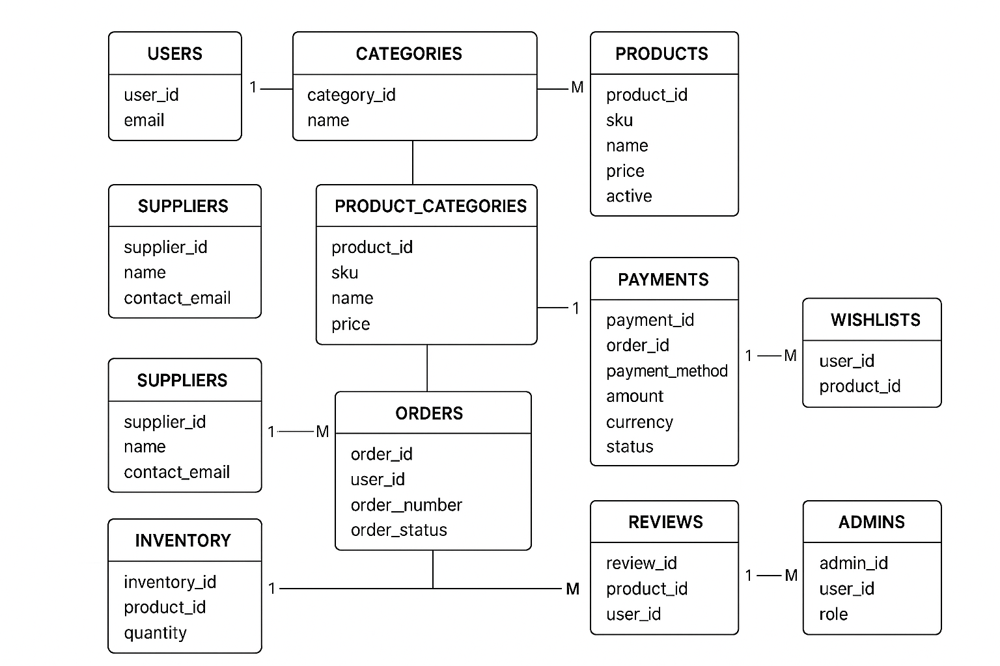

# 📦 E-Commerce Database Management System
## 📌 Overview

This project is a relational database management system (RDBMS) designed in MySQL for an E-Commerce Store.
It manages users, products, orders, payments, reviews, suppliers, and inventory while enforcing relational integrity using primary keys, foreign keys, and constraints.

The database is designed to support:

* Customer account creation

* Product catalog management

* Order placement and tracking

* Secure payments

* Product reviews

* Supplier and inventory management

# 📑 Database Schema
## Entities and Relationships

* Users → Can place orders, write reviews, and add items to wishlists.

* Products → Belong to categories, supplied by suppliers, and linked to inventory.

* Orders → Belong to users, contain multiple products, and are linked to payments.

* Payments → Linked to orders.

* Reviews → Linked to both users and products.

* Suppliers → Provide products.

* Inventory → Tracks stock levels.

* Admins → Manage users and products.

📎 See Relational Database Diagram below:


# ⚙️ Features Implemented

1. Database Creation

``` sql 
CREATE DATABASE ecommerce_db; 
``` 

2. Tables with Constraints

* PRIMARY KEY, FOREIGN KEY, NOT NULL, UNIQUE

* One-to-Many (Users → Orders)

* Many-to-Many (Products ↔ Categories, Orders ↔ Products via junction tables)

3. Sample Data Insertions

``` sql
INSERT INTO Users (name, email) VALUES ('Alice Johnson', 'alice@example.com');
INSERT INTO Products (sku, name, price, active) VALUES ('P001', 'Smartphone X', 699.99, TRUE);
INSERT INTO Orders (user_id, order_number, order_status) VALUES (1, 'ORD12345', 'Pending');
INSERT INTO Payments (order_id, payment_method, amount, currency, status) 
VALUES (1, 'Credit Card', 699.99, 'USD', 'Completed');
```

# 🚀 How to Run

1. Open MySQL Workbench or CLI.
2. Run the provided SQL script:

```
source ecommerce_db.sql;
```

3. Verify tables:
``` sql
SHOW TABLES;
```

4. Insert test data (included in script).

5. Run queries, e.g.:

```sql
SELECT u.name, o.order_number, p.name AS product, pay.amount
FROM Users u
JOIN Orders o ON u.user_id = o.user_id
JOIN Payments pay ON o.order_id = pay.order_id
JOIN Order_Items oi ON o.order_id = oi.order_id
JOIN Products p ON oi.product_id = p.product_id;
```

# 📂 Deliverables

* ecommerce_db.sql → Database schema + sample inserts

* README.md → Documentation (this file)

* relational_db_diagram.png → Database structure illustration

✅ This project demonstrates a complete Database Management System using MySQL with proper schema design, normalization, and constraints.